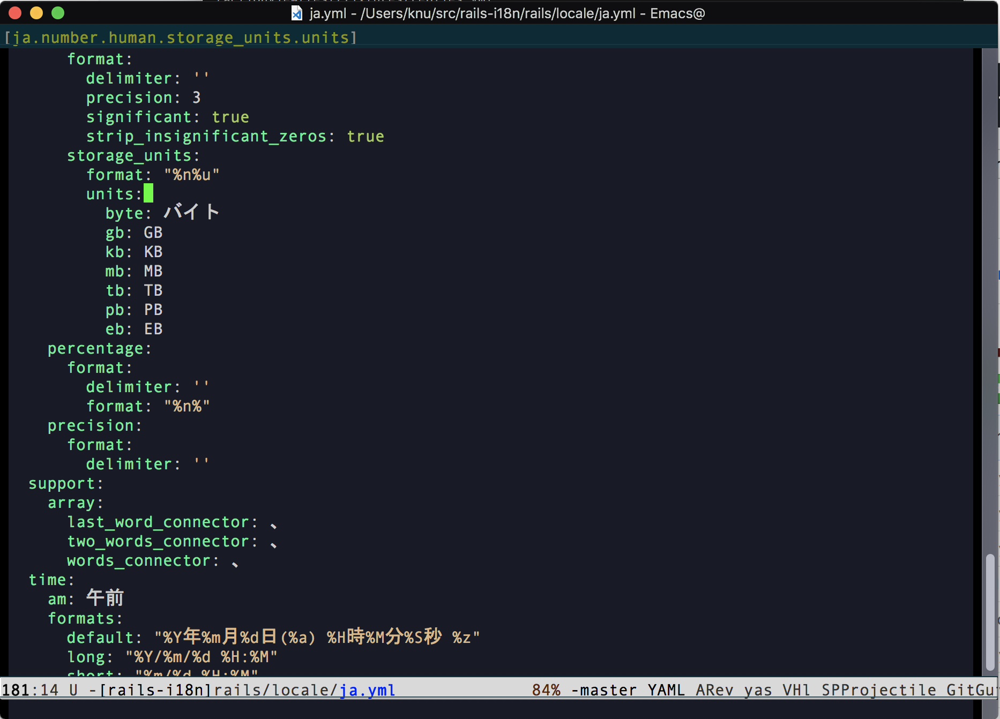
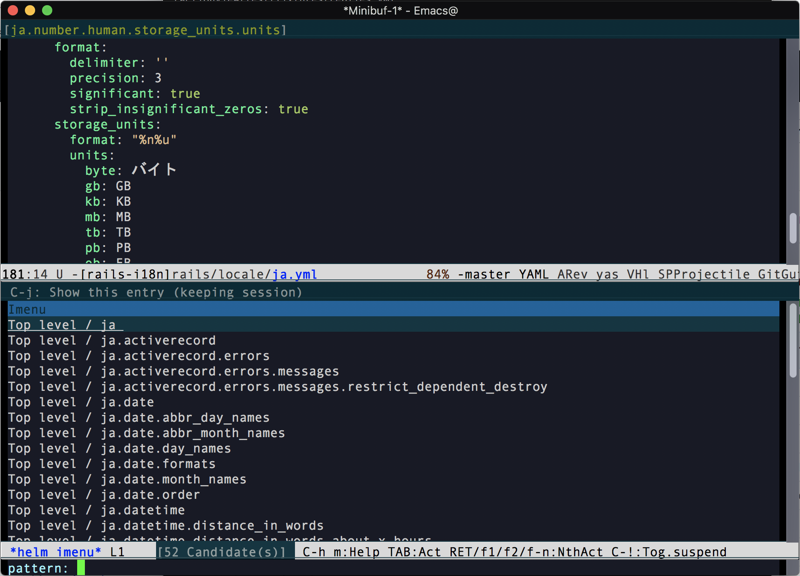

# yaml-imenu.el

This package enhances the imenu support in `yaml-mode`.  It generates
an index containing a full list of keys that contain any child, with
key names in the dot-separated path form like `jobs.build.docker` and
`ja.activerecord.attributes.user.nickname`.  It shines best with
`which-function-mode` enabled.

## Requirements

This package depends on Ruby for parsing YAML documents to obtain
location information of each node.  Ruby >=2.5 works out of the box;
if you have an older version of Ruby, run the following command to
install the latest version of `psych`, the YAML parser:

```console
% gem install psych --user
```

The parser only parses a document without evaluating it, so there
should be no security concerns.

## Configuration

Add the following line to your init file:

```elisp
(yaml-imenu-enable)
```

In Emacs 27 and later, the result of `add-log-current-defun` takes
precedence over the imenu index in `which-function`.  To fix this, add
the following snippet:

```elisp
(defun which-function-from-imenu-index ()
  "Call the imenu-index part in `which-function'.

It is a fallback for when which-func-functions and `add-log-current-defun' return nil."
  (let (which-func-functions)
    (letf (((symbol-function 'add-log-current-defun)
            (lambda () nil)))
      (which-function))))

;; `add-log-current-defun' returns a not so meaningful result in some
;; major modes when the default `add-log-current-defun-function'
;; happens to match a random line that is not really a function
;; definition.  It is often much more desirable to find a function
;; name from an imenu index in those modes.  Results are also used by
;; `which-function-mode'.
(defun enable-add-log-current-defun-using-which-function ()
  (setq-local add-log-current-defun-function 'which-function-from-imenu-index))

(add-hook 'yaml-mode-hook
          'enable-add-log-current-defun-using-which-function)
```

## Usage

A precise YAML node path list this package provides is especially
useful when dealing with a large YAML file.

With `which-func-mode` enabled, you can always see at a glance where
you are.  In this example, the "YAML path" is shown in the header line
instead of the mode line by customizing `header-line-format`.



Using `helm-imenu`, it is extremely easy to navigate to anywhere you
want to go.



## Author

Copyright (c) 2018-2021 Akinori MUSHA.

Licensed under the 2-clause BSD license.  See `LICENSE.txt` for
details.

Visit [GitHub Repository](https://github.com/knu/yaml-imenu.el) for
the latest information.
